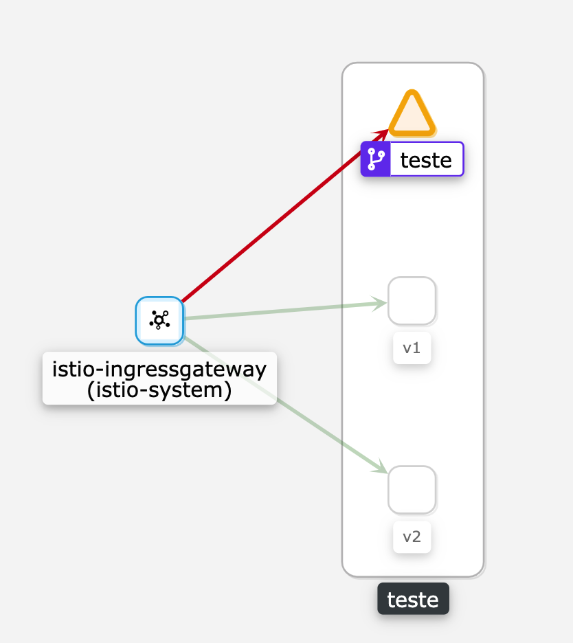

# Go Hello World k8s
# Dependecies

Helm > 3.2
Kubernetes > 1.15

In this test we use istio for service mesh, we will configure destinarion rules and virtualservices for balancing between services.
# Build Image

```bash
docker build -t $TAG_DOCKERFILE .

docker push $TAG_DOCKERFILE
```

In the values file, you need to add the variables for each environment, including the name of the image (if it is a public repository) that was just built using the Dockerfile

# Run Helm Template

To generate the Kubernetes manifest run:

```bash
helm template $APP_NAME -n $APP_NAMESPACE kubernetes/app-base/ -f app/v1/helm-values/values-prod.yaml >> application-prod.yaml     
```

If you want to testart to avoid errors, you can use the dry-run parameter to test locally, the command output to wait is:

```bash
kubectl apply -f --dry-run=client application-prod.yaml

namespace/teste configured (dry run)
service/teste configured (dry run)
deployment.apps/teste configured (dry run)
deployment.apps/teste-v2 configured (dry run)
horizontalpodautoscaler.autoscaling/teste configured (dry run)
destinationrule.networking.istio.io/teste configured (dry run)
gateway.networking.istio.io/teste-istio-gateway configured (dry run)
virtualservice.networking.istio.io/teste configured (dry run)
```

To apply the manifest to the cluster run:

```bash
kubectl apply -f application-prod.yaml     
```

```bash
$ curl localhost:8090
Hello
Hello
Hello
Hello
Hello
Hello
Hello. I’m v2   
Hello
Hello
Hello
Hello
Hello
Hello. I’m v2   
```

\
**Observability with Kiali**

Using Kiali (native istio observability tool) it is possible to see the load balance for the 2 versions of the app
